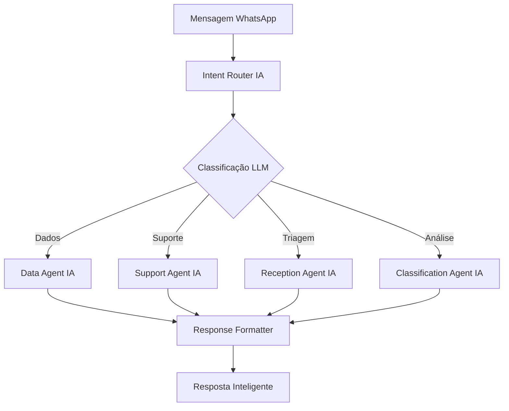

# 🤖 Jarvis WhatsApp LLM Agent Orchestrator v2.0

Sistema revolucionário de orquestração de agentes IA para WhatsApp usando **LangChain**, **LangGraph** e **LLM** (Ollama/OpenAI), transformando conversas simples em experiências inteligentes e contextuais.

## 🚀 Novidades v2.0 - IA Revolucionária

### ✨ **Processamento de Linguagem Natural Avançado**
- **LLM Integrado**: Ollama (local) + OpenAI (fallback)
- **Compreensão Contextual**: Entende nuances e subtextos
- **Respostas Humanas**: Conversas naturais e inteligentes

### 🧠 **Orquestração Inteligente com LangGraph**
- **Fluxo Dinâmico**: Roteamento baseado em IA
- **Classificação Automática**: Intenções detectadas automaticamente
- **Contexto Persistente**: Memória conversacional avançada

### 🎯 **4 Agentes IA Especializados**
1. **🏢 Reception Agent IA**: Triagem inteligente com LLM
2. **🧠 Classification Agent IA**: Classificação avançada de intenções
3. **📊 Data Agent IA**: Análise inteligente de dados e insights
4. **🔧 Support Agent IA**: Diagnóstico técnico automatizado

## ⚙️ Configuração Rápida com IA

### 1. **Pré-requisitos**

```bash
# Docker & Docker Compose
curl -fsSL https://get.docker.com | sh

# Ollama (Servidor LLM Local)
curl -fsSL https://ollama.ai/install.sh | sh
ollama serve
ollama pull llama3.1:8b
```

### 2. **Setup Automatizado IA**

```bash
git clone 
cd whatsapp_agent_orchestrator
chmod +x setup_llm.sh
./setup_llm.sh
```

O script automaticamente:
- ✅ Detecta Ollama/OpenAI
- ✅ Configura variáveis LLM
- ✅ Testa conectividade IA
- ✅ Inicia sistema completo

### 3. **Configuração Manual (Alternativa)**

```bash
# Clone e configure
cp .env.example .env

# Configure no .env:
OLLAMA_BASE_URL=http://192.168.15.31:11435
OLLAMA_MODEL=llama3.1:8b
OPENAI_API_KEY=your_key_here  # Opcional (fallback)

# Inicie
docker-compose up -d
```

## 🧪 Teste a Inteligência

### **Teste Automatizado Completo**
```bash
chmod +x test_llm.sh
./test_llm.sh +5511999999999  # Seu número WhatsApp
```

### **Teste Manual dos Endpoints IA**
```bash
# Status da IA
curl http://localhost:8000/llm/status

# Teste direto do LLM
curl -X POST http://localhost:8000/llm/test \
  -H "Content-Type: application/json" \
  -d '{"prompt": "Analise: preciso de relatório de vendas"}'

# Análise de conversa
curl http://localhost:8000/analyze/+5511999999999

# Sugestões inteligentes
curl http://localhost:8000/suggestions/+5511999999999?context=suporte
```

## 💬 Conversas Inteligentes - Exemplos

### **📊 Consulta de Dados Avançada**
```
👤 "Preciso de uma análise detalhada das vendas, incluindo 
    comparativo com mês anterior e projeções"

🤖 "📊 **ANÁLISE COMPLETA DE VENDAS - NOVEMBRO/2024**

💰 Receita Atual: R$ 125.000,00
📈 Mês Anterior: R$ 98.000,00  
📊 Crescimento: +27.6% 🟢

👥 Clientes Ativos: 1.247 (+89)
🎯 Taxa Conversão: 3.2% (+0.4%)
📈 **Projeção Dezembro**: R$ 145.000 (baseado em tendência)

✨ Status: 🟢 **Excelente performance!**
🎯 **Recomendação**: Manter estratégia atual e investir em marketing"
```

### **🔧 Suporte Técnico Inteligente**
```
👤 "Sistema travando no login, erro 500"

🤖 "🔧 **DIAGNÓSTICO AUTOMÁTICO INICIADO**

🔍 **Análise do Problema:**
- Erro 500: Problema servidor/banco de dados
- Login: Provável sobrecarga de autenticação

⚡ **SOLUÇÕES IMEDIATAS:**
1️⃣ Limpe cache e cookies
2️⃣ Tente modo anônimo
3️⃣ Aguarde 5 minutos (auto-recovery ativo)

🎫 **Ticket Criado:** TK47291
🚨 **Escalado para:** Equipe L2 (SLA: 30min)

💬 Vou acompanhar a resolução. Te atualizo em 15min!"
```

## 🛠️ Arquitetura IA Avançada

### **LangGraph Workflow**


### **Stack Tecnológico**
- **🧠 LLM**: Ollama (Llama 3.1) + OpenAI (fallback)
- **🔄 Orquestração**: LangGraph + LangChain
- **📱 WhatsApp**: Twilio API
- **💾 Sessões**: Redis com contexto IA
- **🚀 API**: FastAPI assíncrono
- **🐳 Deploy**: Docker + Docker Compose

## 📡 Endpoints IA Disponíveis

### **Básicos**
- `GET /` - Dashboard visual com status IA
- `POST /webhook/whatsapp` - Webhook Twilio (IA-powered)
- `GET /health` - Health check com status IA
- `GET /status` - Status detalhado (LLM + LangGraph)

### **LLM & IA (Novos)**
- `GET /llm/status` - Status específico do LLM
- `POST /llm/test` - Teste direto do LLM
- `GET /analyze/{phone}` - Análise IA da conversa
- `GET /suggestions/{phone}` - Sugestões inteligentes

### **Gerenciamento**
- `POST /send` - Envio manual de mensagens
- `POST /reset-session` - Reset de sessão (+ memória IA)
- `POST /broadcast` - Broadcast inteligente

## 🎛️ Configurações IA Avançadas

### **Modelos LLM Suportados**
```bash
# Recomendados para produção
llama3.1:8b      # Equilibrado (padrão)
qwen2.5:7b       # Rápido e eficiente
mistral:7b       # Bom para análise

# Para análises complexas
llama3.1:70b     # Muito potente (requer recursos)
codellama:7b     # Especializado em código
```

### **Tuning de Performance**
```bash
# .env - Configurações otimizadas
LLM_TEMPERATURE=0.7      # Criatividade vs Precisão
LLM_MAX_TOKENS=500       # Tamanho das respostas
AGENT_MEMORY_SIZE=10     # Histórico mantido
CONTEXT_WINDOW=4000      # Contexto por conversa
```

### **Personalização dos Agentes**
```python
# Exemplo: Agente customizado
class CustomAgent(LLMBaseAgent):
    def _get_system_prompt(self) -> str:
        return """Você é um especialista em [SUA_ÁREA].
        [SUAS_INSTRUÇÕES_ESPECÍFICAS]"""
    
    def _is_intent_compatible(self, intent: str) -> bool:
        return intent == "custom_intent"
```

## 📊 Monitoramento IA

### **Dashboard Inteligente**
```bash
# Acesse: http://localhost:8000
# Mostra: Status LLM, agentes ativos, métricas de IA
```

### **Logs Estruturados**
```bash
# Em tempo real
docker-compose logs -f jarvis-whatsapp

# Análise específica
docker-compose logs jarvis-whatsapp | grep "LLM"
```

### **Métricas de IA**
- Tempo de resposta LLM
- Taxa de sucesso na classificação
- Confiança média das respostas
- Sessões ativas com contexto
- Performance por agente

## 🚀 Deploy Produção IA

### **Docker Swarm com IA**
```yaml
version: '3.8'
services:
  jarvis-llm:
    image: jarvis-whatsapp-llm:latest
    deploy:
      replicas: 3
      resources:
        limits:
          memory: 2G      # Mais memória para IA
          cpus: '2.0'     # Mais CPU para LLM
    environment:
      - OLLAMA_BASE_URL=http://ollama-cluster:11434
      - LLM_TEMPERATURE=0.5  # Produção mais conservadora
```

### **Cluster Ollama**
```bash
# Setup cluster Ollama para alta disponibilidade
docker run -d --name ollama-node1 -p 11434:11434 ollama/ollama
docker run -d --name ollama-node2 -p 11435:11434 ollama/ollama
```

## 🔒 Segurança IA

- **🛡️ Validação LLM**: Entrada/saída sanitizada
- **🔐 Rate Limiting**: Por usuário e endpoint
- **📝 Logs Seguros**: Sem dados sensíveis
- **🚫 Content Filter**: Filtragem automática de conteúdo

## 📈 Performance & Escalabilidade

### **Benchmarks**
- **Latência LLM**: 500-2000ms (dependendo do modelo)
- **Throughput**: 100+ conversas simultâneas
- **Memória**: 1-4GB por instância (+ modelo LLM)
- **CPU**: Otimizado para GPU (CUDA) quando disponível

### **Otimizações**
```bash
# Para máxima performance
LLM_MODEL=qwen2.5:7b        # Modelo mais rápido
LLM_TEMPERATURE=0.3         # Menos variabilidade
LLM_MAX_TOKENS=300          # Respostas mais concisas
AGENT_MEMORY_SIZE=5         # Menos contexto
```

## 🤝 Contribuindo para a IA

### **Adicionando Novos Agentes IA**
1. Herde de `LLMBaseAgent`
2. Implemente `_get_system_prompt()`
3. Registre no `LangGraphOrchestrator`
4. Teste com `test_llm.sh`

### **Melhorando Prompts**
- Siga padrões de prompt engineering
- Use few-shot learning quando necessário
- Teste com múltiplos modelos
- Valide saída com testes automatizados

## 📄 Licença

Este projeto está sob licença MIT. Veja `LICENSE` para detalhes.

## 🆘 Suporte & Comunidade

- 📧 **Email**: suporte@jarvis-ia.com
- 💬 **Discord**: [Comunidade Jarvis IA]
- 📖 **Docs IA**: [docs.jarvis-ia.com]
- 🐛 **Issues**: [GitHub Issues]

---

**🤖 Desenvolvido com ❤️ e IA avançada para revolucionar conversas no WhatsApp**

### 🎯 **Próximos Recursos (Roadmap)**
- 🔊 **Voice-to-Text** com Whisper
- 🖼️ **Análise de Imagem** com Vision Models  
- 🌐 **Multi-idioma** automático
- 📱 **App Mobile** para gestão
- 🔗 **Integração CRM/ERP** nativa
- 🧠 **Fine-tuning** personalizado

**Jarvis v2.0 - Onde Conversação encontra Inteligência Artificial! 🚀🤖**